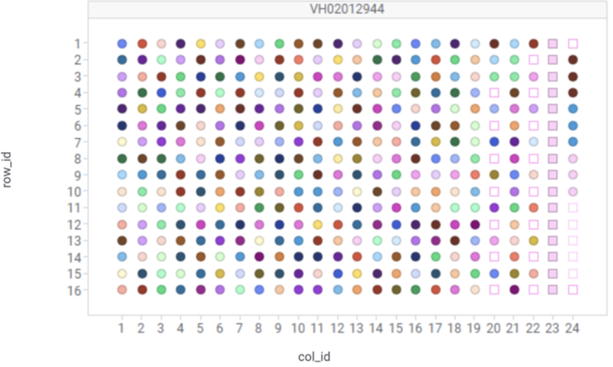

# DRUG-seq U2OS MoA Box  

## Authorship
Andrea Hadjikyriacou, Chian Yang, Martin Henault, Robin Ge, Leandra Mansur, Alicia Lindeman, Carsten Russ, Steffen Renner, Marc Hild, Jeremy Jenkins, Caroline Gubser-Keller, Jingyao Li, Daniel J. Ho, Marilisa Neri, Frederic D. Sigoillot, Robert Ihry

## Background
DRUG-seq is an open-source high throughput transcriptomics platform. In order to facilitate the development of new computational analysis methods, that require large-scale unbiased transcriptomic data, we are making the DRUG-seq MoA Box dataset publicly available to drive innovation. Please reference the dataset using Ye et. al., 2018 [[1]](#1), and the associated GitHub and Zenodo links provided. We look forward to hearing about the new methods development and hoping to see the future publications that follow!

We profiled a large set of small molecules (N = 4,343), including the previously released Mechanism of Action (MoA) Box (Canham et al., 2020 [[2]](#2) and [Novartis MoA Box GitHub](https://github.com/Novartis/MoaBox)) in the Osteosarcoma U2-OS cell line in a 4-dose response (0.01, 0.1, 1 and 10 microMolar) at one treatment timepoint (24.0hrs), using the high-throughput transcriptomics profiling method DRUG-seq (Ye et al., 2018 [[1]](#1), Li et al., 2022 [[3]](#3), and [Novartis DRUG-seq GitHub](https://github.com/Novartis/DRUG-seq) ). The profiles cover an additional 640 public compound structures part of the evolving Novartis MoA Box collection.

Here we share the following metadata and data:
- plate well-level gene UMI counts
- contrast-level for each compound, dose, timepoint and batch: gene fold change and associated statistics.
- reduced feature space derivatives of the UMI counts (PCA, UMAP) results (and associated pre-filtered and normalized count matrix data files) are provided before/after limma RemoveBatchEffect batch correction.

## Dataset Content Statistics and processing information
### 1. Content description and medata files
  The dataset consists of 52 batches of 3 replicate 384-well plates (156 x 384-well plates), resulting in a total of 156*384 = 59,904 Next Generation Sequencing samples (uniquely identified by biosample_id/external_biosample_id columns in provided metadata) and associated transcriptome profiles. The subset of unused wells (N = 3276) was annotated with the filler well_type=EMPTY and water (H2O) identifier (cmpd_sample_id: EC-27-RY89). There were 56,628 wells=samples effectively used in the data processing post UMI counts generation, representing 4,343 unique compounds tested in 4-dose response and triplicate (one replicate per plate across 3 replicate plates in a batch), except for a few positive controls (Homoharringtonine cmpd_sample_id: EA-18-FP00; BTdCPU cmpd_sample_id: SE-15-AV21; cmpd_sample_id: BD-11-DV28 ) shared between all batches and plates that were represented in triplicate per plate (9 wells per batch) at 10 microMolar and the Reference Control (RC) DMSO wells (cmpd_sample_id: CB-43-EP73) represented in column 23 (16 wells per plate). The positive controls were selected with the expectation they can have a large impact on cell proliferation and transcriptome profile.

  a. Metadata files (3 files) for 59,904 DRUG-seq samples and MoABox public compounds annotation: 
   ***./DRUGseq_U2OS_MoABox_plate_wells_metadata_public.txt*** # contains plate and well-level metadata for the 59,904 DRUG-seq samples including plate and well identifiers, compound identifier (cmpd_sample_id), dose, timepoint. The cmpd_sample_id column allows mapping to compounds metadata in the next file. 
   ***./MoABox_compounds_metadata.txt*** # contains 4,345 compounds (4,343 compounds + DMSO + Water) with annotation of structure (inchi_key and SMILES) and mechanism of action (MoA) when available.
   ***./MoABox_compounds_target_pairs_public.txt*** # contains row-separated compounds (inchi_key) / target (gene, symbol) pairs annotation when available. 
  *For reference*: 
  - Water (H2O; well_type = EMPTY): cmpd_sample_id: EC-27-RY89; inchi_key: 'XLYOFNOQVPJJNP-UHFFFAOYSA-N'; SMILES: 'O' 
  - Dimethyl Sulfoxide (DMSO; well_type=RC): cmpd_sample_id: CB-43-EP73; inchi_key: 'IAZDPXIOMUYVGZ-UHFFFAOYSA-N'; SMILES: 'CS(C)=O' 
  - Wells (NGS samples) are uniquely identified by metadata columns including ‘biosample_id’/‘external_biosample_id’ 
  - Compound samples are uniquely identified by metadata columns including ‘cmpd_sample_id’ 

  *Example of a DRUG-seq 384-well plate content format (384-well plate VH02012944)*
   

  - Tested samples (well_type = ‘SA’) are represented as circles 
  - The series of 16 Reference Control (well_type = ‘RC’) DMSO-treated wells are represented by filled squares in column 23 
  - Non-effective wells (no treatment) are represented by empty squares (well_type = EMPTY) and annotated as the water cmpd_sample_id. 
  - SA wells in column 24 consist of 3 replicates of 10 microMollar for each of 3 positive controls (BD-11-DV28, BTdCPU and Homoharringtonine). 

  b. Genes annotation files 
    ***./drugseq_ensembl_v98_annotation_and_entrez_mapping.RData*** # contains 3 items, drugseq_ensg_v98 has DRUG-seq data gene.ID to Ensembl (Version 98) ENSG gene identifiers mapping and two items have full join and inner join mapping to ENTREZ gene ID and associated gene information (drugseq_ensg_v98_entrez_mapping, drugseq_ensg_v98_entrez_mapping_notNULL) 

### 2. Data processing and data files

The dataset was processed with the Novartis DRUG-seq data processing/analysis pipeline, following the method described in Li et al., 2022 [[3]](#3) with the exception that after the TRUE NULL first step, two robust Reference Control (RC) DMSO wells were selected per plate, hence a total of 6 RC wells per batch, and used in fold change calculations final step. In order to generate the PCA and UMAP views, samples for contrasts defined as ‘active’ over TRUE NULL-defined background activity threshold (global threshold across 52 batches, 5-percentile of DMSO versus DMSO contrasts evaluated: >17 differentially expressed genes).  

  a. plate_well-level gene UMI counts are provided for all 59,904 wells in the file (well_type: SA, RC and EMPTY). Please note the dataset was saved with gzip compression to minimize the file size. We recommend loading the object in R and saving it locally as e.g. uncompressed RData file to allow faster loading for subsequent processing steps. 
   ***./Exp_gzip.RData***

  b. Sample groups and comparisons metadata files 
   ***./robust_RC_ReferenceControl_DMSO_wells.txt*** # set of Reference Control (RC) DMSO wells selected as robust after the TRUE NULL step1 and used in fold change calculations per batch 
   ***./comparisons_metadata.RData*** # contain 2 objects, comparison_group_member_info_public shows the samples groups setup to feed into the comparisons and comparisons_info_public shows metadata for the comparisons. 

  c. Fold Change calculations result files 
   ***./de.RData*** # data.frame aggregating all 17,731contrasts across 52 batches 

### 3. PCA and UMAP dimensionality reduction and resulting files: 

  a. UMI count matrix filtering, before/after batch correction 
   ***./mat.filtered_before_RemoveBatchEffect.RData*** # UMI count matrix after filtering samples (samples for contrasts with a number of differentially expressed genes above the threshold of 17; TRUE NULL 95%ile threshold across batches and select RC control wells ) and genes per the published method, before limma::RemoveBatchEffect was applied on plate_barcodes 
   ***./mat.filtered_after_RemoveBatchEffect.RData*** # UMI count matrix after filtering samples (samples for contrasts with a number of differentially expressed genes above the threshold of 17; TRUE NULL 95%ile threshold across batches and select RC control wells ) and genes per the published method, after limma::RemoveBatchEffect was applied on plate_barcodes 

  b. PCA result files (before/after batch correction) 
   ***./pca_filtered_before_RemoveBatchEffect.RData*** 
   ***./pca_filtered_after_RemoveBatchEffect.RData***    

  c. UMAP results files (2D and 3D, before and after RemoveBatchEffect) 
   ***./umap_2D_coordinates_filtered_before_and_after_RemoveBatchEffect.txt*** 
   ***./umap_3D_coordinates_filtered_before_and_after_RemoveBatchEffect.txt*** 

## Files content excerpts: 
See README_pdf.pdf file in this folder
 
## References
<a id="1">[1]</a>  Ye C, Ho DJ, Neri M, Yang C, Kulkarni T, Randhawa R, Henault M, Mostacci N, Farmer P, Renner S, Ihry R, Mansur L, Keller CG, McAllister G, Hild M, Jenkins J, Kaykas A. 
DRUG-seq for miniaturized high-throughput transcriptome profiling in drug discovery. Nat Commun. 2018 Oct 17;9(1):4307. PMID: 30333485; PMCID: PMC6192987. 

<a id="2">[2]</a>  Canham SM, Wang Y, Cornett A, Auld DS, Baeschlin DK, Patoor M, Skaanderup PR, Honda A, Llamas L, Wendel G, Mapa FA, Aspesi P Jr, Labbé-Giguère N, Gamber GG, Palacios DS, Schuffenhauer A, Deng Z, Nigsch F, Frederiksen M, Bushell SM, Rothman D, Jain RK, Hemmerle H, Briner K, Porter JA, Tallarico JA, Jenkins JL. Systematic Chemogenetic Library Assembly. Cell Chem Biol. 2020 Sep 17;27(9):1124-1129. doi: 10.1016/j.chembiol.2020.07.004. Epub 2020 Jul 23. PMID: 32707038. 

<a id="3">[3]</a> Li J, Ho DJ, Henault M, Yang C, Neri M, Ge R, Renner S, Mansur L, Lindeman A, Kelly B, Tumkaya T, Ke X, Soler-Llavina G, Shanker G, Russ C, Hild M, Gubser Keller C, Jenkins JL, Worringer KA, Sigoillot FD, Ihry RJ. DRUG-seq Provides Unbiased Biological Activity Readouts for Neuroscience Drug Discovery. ACS Chem Biol. 2022 Jun 17;17(6):1401-1414. doi: 10.1021/acschembio.1c00920. Epub 2022 May 4. PMID: 35508359; PMCID: PMC9207813. 

### GitHub links 

### Zenodo link: 
